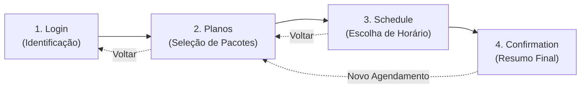
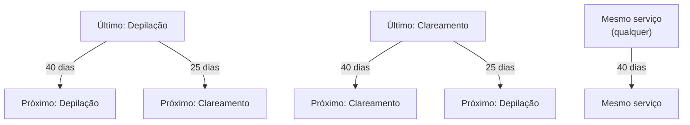
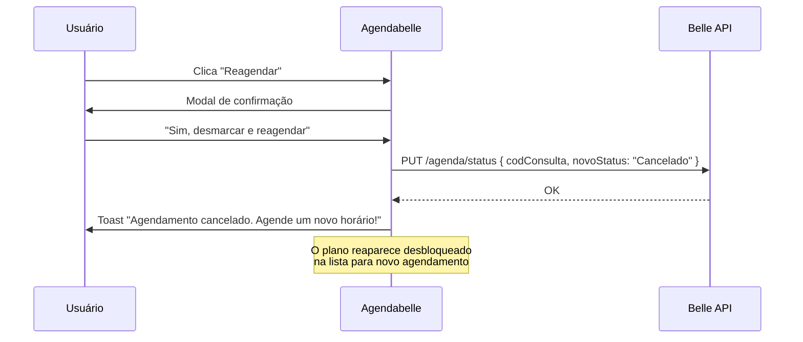

# Agendabelle — Documentação Completa do Sistema

> Sistema de agendamento online para clínicas de estética e depilação a laser, integrado com a API **Belle Software**.  
> **URL de produção:** `https://agenda.esteticaelaser.com.br/`

---

## Índice

1. [Visão Geral da Arquitetura](#1-visão-geral-da-arquitetura)
2. [Fluxo Completo de Agendamento (Passo a Passo)](#2-fluxo-completo-de-agendamento)
3. [Rotas do Frontend](#3-rotas-do-frontend)
4. [Endpoints da API Belle Software](#4-endpoints-da-api-belle-software)
5. [Regras de Negócio](#5-regras-de-negócio)
6. [Interfaces e Tipos de Dados](#6-interfaces-e-tipos-de-dados)
7. [Funções Utilitárias](#7-funções-utilitárias)
8. [Gerenciamento de Agendamentos Existentes](#8-gerenciamento-de-agendamentos-existentes)
9. [Estrutura de Arquivos](#9-estrutura-de-arquivos)

---

## 1. Visão Geral da Arquitetura

| Camada | Tecnologia |
|---|---|
| Framework | React 18 + TypeScript |
| Build Tool | Vite |
| Estilização | TailwindCSS + shadcn/ui |
| Roteamento | React Router DOM |
| Estado Servidor | TanStack React Query |
| Toasts | Sonner |
| API Externa | Belle Software REST API |

### Unidades Atendidas

O sistema atende **5 unidades**, cada uma com seu token de autenticação:

| ID | Label | Token |
|---|---|---|
| `mantena` | Mantena | `452166ad16be9184c85db73a97832d55` |
| `sao-mateus` | São Mateus | `47ad4592f0438b5f4ba37c05e2ffc7e9` |
| `linhares` | Linhares | `76683f1105194b9f9544cb9f1b356a5b` |
| `aracruz` | Aracruz | `d4fd49c6235cbe09ea4cb0827f51f575` |
| `serra` | Serra | `8471d37f86e5c2d2cb213d8e092f2c64` |

**Base URL da API:** `https://app.bellesoftware.com.br/api/release/controller/IntegracaoExterna/v1.0`

---

## 2. Fluxo Completo de Agendamento

O agendamento é um fluxo linear de **4 etapas** (steps), controlado por um estado `step` na página [Index.tsx](file:///home/rhiangeraldo/Desenvolvimentos/agendabelle/src/pages/Index.tsx):



### Indicador de Progresso
A tela exibe 4 bolinhas horizontais que mudam de cor conforme o step atual:
- **Step ativo**: barra larga com `bg-primary`
- **Steps completos**: barra menor com `bg-primary/50`
- **Steps futuros**: barra menor com `bg-muted`

---

### Etapa 1 — Login / Identificação

**Componente:** [LoginStep.tsx](file:///home/rhiangeraldo/Desenvolvimentos/agendabelle/src/components/scheduling/LoginStep.tsx)

**O que o usuário faz:**
1. Seleciona a **unidade** (dropdown com as 5 unidades)
2. Digita o **CPF** (com máscara `000.000.000-00`)
3. Clica em **"Continuar"**

**O que acontece por trás:**
1. Remove caracteres não-numéricos do CPF
2. Valida se o CPF tem 11 dígitos
3. Chama `buscarCliente(unit, cpf)` → **API GET**
4. Se o cliente é encontrado (tem `codigo`), dispara `onClienteFound(unit, cliente)`
5. Salva no `localStorage`:
   - `agendabelle_unit` → ID da unidade
   - `agendabelle_cliente` → JSON do cliente

**Cache / Auto-login:**
Ao carregar a página, o `Index.tsx` verifica se existe cache no `localStorage`. Se sim, pula direto para a etapa de Planos.

**API chamada:**

```
GET /cliente/listar?codEstab=1&cpf={cpf}
Authorization: {token_da_unidade}
```

**Retorno esperado (`Cliente`):**
```json
{
  "codigo": 12345,
  "nome": "Maria da Silva",
  "cpf": "12345678901",
  "dtNascimento": "01/01/1990",
  "celular": "(27) 99999-9999",
  "email": "maria@email.com"
}
```

---

### Etapa 2 — Seleção de Planos

**Componente:** [PlansStep.tsx](file:///home/rhiangeraldo/Desenvolvimentos/agendabelle/src/components/scheduling/PlansStep.tsx)

**O que acontece ao entrar nesta etapa:**
1. Chama `buscarPlanos(unit, 1, cliente.codigo)` → lista os planos do cliente
2. Em paralelo (via `Index.tsx`), busca os agendamentos abertos e finalizados dos últimos/próximos 2 meses para verificar se já existe agendamento para cada plano

**O que o usuário vê:**
- Saudação personalizada: *"Olá, {primeiro_nome}!"*
- Lista de **planos/pacotes** do cliente, cada um exibindo:
  - Nome do plano
  - Serviços inclusos com saldo restante (`nome (Nx)`)
  - Badge **"Já existe um agendamento"** (laranja) se o plano já tiver agendamento ativo
- Botão **"Agendar múltiplos pacotes"** (se houver > 1 plano disponível)
- Seção **"Seus Agendamentos"** (componente `AppointmentsStep` embutido)

**Fluxo de seleção:**

| Ação | Resultado |
|---|---|
| Clicar em um plano desbloqueado | Chama `buscarServicos(unit, codPlano)` e avança para Schedule |
| Clicar em um plano bloqueado (já agendado) | Exibe toast informativo |
| Clicar em "Agendar múltiplos pacotes" | Abre modal com checkboxes para multi-seleção |

**Validação de multi-seleção:**
- ⛔ **Depilação + Clareamento juntos = BLOQUEADO** (intervalo de 25 dias entre eles)
- O sistema verifica por nome do plano/serviço se contém "depila" ou "clareamento"

**APIs chamadas:**

```
GET /cliente/planos?codEstab=1&codCliente={codCliente}
Authorization: {token}
```

**Retorno (`Plano[]`):**
```json
[
  {
    "codPlano": 101,
    "nome": "Depilação a Laser - Corpo Inteiro",
    "label": "...",
    "servicos": [
      { "codServico": 201, "nome": "Axilas", "saldoRestante": 5 },
      { "codServico": 202, "nome": "Virilha", "saldoRestante": 3 }
    ]
  }
]
```

```
GET /servico/listar?codPlano={codPlano}
Authorization: {token}
```

**Retorno (`Servico[]`):**
```json
[
  {
    "codSaldo": 1,
    "codPlano": 101,
    "codServico": 201,
    "nome": "Axilas - Depilação a Laser",
    "label": "...",
    "valor": "150.00",
    "saldoAtual": "5",
    "saldoRestante": "5",
    "saldoTotal": "10",
    "tempo": 10,
    "usaDia": "N",
    "diaRetorno": 40,
    "categoria": "Depilação",
    "tipo": "Sessão"
  }
]
```

---

### Etapa 3 — Escolha de Horário

**Componente:** [ScheduleStep.tsx](file:///home/rhiangeraldo/Desenvolvimentos/agendabelle/src/components/scheduling/ScheduleStep.tsx)

Esta é a etapa mais complexa. Funciona em **2 fases**:

#### Fase 1 — Cálculo da Data Mínima Permitida

1. Busca o **histórico completo** do cliente (3 meses passados + 3 meses futuros)
2. Filtra apenas eventos com status válidos: `Atendido`, `Aguardando`, `Em Andamento`, `Marcado`, `Confirmado`
3. Aplica as **regras de intervalo**:

| Último procedimento | Agendando agora | Intervalo mínimo |
|---|---|---|
| Depilação | Depilação | **40 dias** |
| Depilação | Clareamento | **25 dias** |
| Clareamento | Clareamento | **40 dias** |
| Clareamento | Depilação | **25 dias** |
| Mesmo serviço | Mesmo serviço | **40 dias** |

4. Se a data mínima cair num domingo, avança para segunda-feira
5. Define `minAllowedDate` e `targetDate` com a data calculada

**APIs chamadas (Fase 1):**

```
GET /agendamentos/finalizados?codEstab=1&dtInicio={-3meses}&dtFim={+3meses}
GET /agendamentos?codEstab=1&dtInicio={-3meses}&dtFim={+3meses}
Authorization: {token}
```

#### Fase 2 — Carregamento dos Horários Disponíveis

Quando `targetDate` é definido/alterado:

1. Calcula **2 datas-base** para busca:
   - A própria `targetDate`
   - A próxima segunda-feira a partir de `targetDate`
2. Para cada data-base, busca disponibilidade em **3 períodos**: `manha`, `tarde`, `noite`
3. Busca também os agendamentos abertos para aquelas datas
4. Mescla os resultados por data, deduplica profissionais e seus horários
5. Exibe exatamente **7 dias** de resultados

**API chamada (Fase 2):**

```
GET /agenda/disponibilidade?codEstab=1&dtAgenda={dd/MM/yyyy}&periodo={manha|tarde|noite}&tpAgd=s
Authorization: {token}
```

**Retorno (`DiaAgenda[]`):**
```json
[
  {
    "nome": "Segunda-feira",
    "data": "10/06/2026",
    "disp": "S",
    "horarios": [
      {
        "codProf": 5,
        "tempo_intervalo": "5",
        "nome": "Sala 1",
        "horarios": [
          { "horario": "08:00", "cod": "l", "bloq": "l" },
          { "horario": "08:05", "cod": "l", "bloq": "l" },
          { "horario": "08:10", "cod": "o", "bloq": "l" }
        ]
      }
    ]
  }
]
```

> **Legenda dos slots:**
> - `cod = "l"` + `bloq = "l"` → **Livre** (disponível)
> - `cod = "o"` → **Ocupado**
> - Qualquer `bloq ≠ "l"` → **Bloqueado**

#### Cálculo de Horários Válidos

A função `calcularHorariosDisponiveis()` recebe os slots de um profissional e o tempo total necessário. Ela:

1. Calcula quantos slots de 5 min são necessários (`tempoTotal / 5`)
2. Filtra apenas slots livres (`cod = "l"` e `bloq = "l"`)
3. Remove duplicatas e ordena
4. Percorre os slots procurando sequências **consecutivas** (diferença de exatamente 5 min entre cada)
5. Retorna apenas os horários de **início** válidos

> **Filtro de Sala**: Apenas profissionais cujo nome contém "sala" (case-insensitive) são exibidos.

#### O que o usuário vê:

- **Date picker** (calendário) pré-selecionado na data mínima calculada
- Informações: pacotes selecionados, tempo total estimado, serviços com duração
- **Accordion por dia** → dentro, accordion por **Sala** → dentro, accordion por **período** (Manhã/Tarde/Noite)
- Grid de botões com os horários disponíveis
- Botão **"Confirmar Agendamento"** (habilitado quando um slot é selecionado)

#### Gravação do Agendamento

Ao clicar em "Confirmar Agendamento":

1. Para cada plano na `selection`, grava sequencialmente com horários encadeados:
   - Plano 1 começa no horário selecionado
   - Plano 2 começa logo após a duração do Plano 1
   - E assim por diante...

**API chamada:**

```
POST /agenda/gravar
Authorization: {token}
Content-Type: application/json
```

**Body enviado:**
```json
{
  "codCli": 12345,
  "codEstab": 1,
  "prof": { "cod_usuario": "", "nom_usuario": "" },
  "dtAgd": "10/06/2026",
  "hri": "08:00",
  "serv": [
    { "codServico": "201", "tempo": "10" },
    { "codServico": "202", "tempo": "15" }
  ],
  "codPlano": "101",
  "agSala": true,
  "codSala": 5,
  "codVendedor": "",
  "observacao": "Incluso por Agenda Estética e Laser"
}
```

**Retorno (sucesso):**
```json
{
  "dis": true,
  "msg": "Agendamento realizado com sucesso",
  "codConsulta": 99999
}
```

**Retorno (falha):**
```json
{
  "dis": false,
  "msg": "Horário indisponível"
}
```

#### Tratamento de Falha Parcial (Multi-Pacote)

Se o sistema está gravando 3 planos e o 2º falha:
- Os planos **já gravados com sucesso** são mantidos
- Os planos que falharam são listados como `failedItems` com o motivo amigável
- O usuário é levado para a Confirmação com ambas as listas

---

### Etapa 4 — Confirmação

**Componente:** [ConfirmationStep.tsx](file:///home/rhiangeraldo/Desenvolvimentos/agendabelle/src/components/scheduling/ConfirmationStep.tsx)

**O que o usuário vê:**
- ✅ Ícone de sucesso
- Resumo completo:
  - Nome do cliente
  - Planos agendados com serviços
  - Data, horário de início, tempo total
- ⚠️ Se houve falhas parciais: card laranja listando cada plano que falhou com o motivo
- Botão **"Novo Agendamento"** → volta para a etapa de Planos

---

## 3. Rotas do Frontend

| Rota | Componente | Descrição |
|---|---|---|
| `/` | `Index.tsx` | Página principal com todo o fluxo de agendamento |
| `*` | `NotFound.tsx` | Página 404 |

> [!NOTE]
> A aplicação é uma **SPA (Single Page Application)** com apenas 1 rota funcional. Todo o fluxo é controlado por estado interno (`step`), não por rotas.

---

## 4. Endpoints da API Belle Software

Todas as chamadas utilizam o header `Authorization: {token}` (sem prefixo Bearer).

### GET — Consultas

| Endpoint | Função | Parâmetros | Retorno |
|---|---|---|---|
| `/cliente/listar` | `buscarCliente()` | `codEstab`, `cpf` | `Cliente` |
| `/cliente/planos` | `buscarPlanos()` | `codEstab`, `codCliente` | `Plano[]` |
| `/cliente/agenda` | `buscarHistoricoAgenda()` | `codEstab`, `codCliente`, `dtInicio`, `dtFim` | `AgendamentoHistorico[]` |
| `/agendamentos` | `buscarAgendamentosAbertos()` | `codEstab`, `dtInicio`, `dtFim` | `AgendamentoHistorico[]` |
| `/agendamentos/finalizados` | `buscarAgendamentosFinalizados()` | `codEstab`, `dtInicio`, `dtFim` | `AgendamentoHistorico[]` |
| `/servico/listar` | `buscarServicos()` | `codPlano` | `Servico[]` |
| `/agenda/disponibilidade` | `buscarDisponibilidade()` | `codEstab`, `dtAgenda`, `periodo`, `tpAgd` | `DiaAgenda[]` |

### POST — Ações

| Endpoint | Função | Body | Retorno |
|---|---|---|---|
| `/agenda/gravar` | `gravarAgendamento()` | Objeto de booking (ver seção 2.3) | `{ dis, msg, codConsulta }` |

### PUT — Alterações

| Endpoint | Função | Body | Retorno |
|---|---|---|---|
| `/agenda/status` | `alterarStatusAgendamento()` | `{ codConsulta, novoStatus }` | `{}` (pode ser vazio) |

**Valores possíveis para `novoStatus`:**
- `"Cancelado"` — usado ao reagendar
- `"Confirmado"` — confirmação do cliente
- `"Aguardando"` — check-in na clínica

---

## 5. Regras de Negócio

### 5.1 Intervalos entre Procedimentos



### 5.2 Validação de Multi-Seleção
- ❌ **Não é permitido** selecionar Depilação e Clareamento juntos no mesmo agendamento
- ✅ Múltiplos planos do mesmo tipo podem ser selecionados

### 5.3 Detecção de Planos Já Agendados
- Planos com serviços que possuem agendamento com status `Marcado` ou `Confirmado` ficam bloqueados (exibidos com badge laranja)

### 5.4 Agendamento em Sala
- O sistema filtra **apenas profissionais do tipo "Sala"** (nome contém "sala")
- O campo `agSala: true` é enviado na gravação
- `codSala` recebe o `codProf` da sala selecionada

### 5.5 Slots de 5 Minutos
- A API retorna disponibilidade em slots de 5 minutos
- O sistema valida que existem slots **consecutivos suficientes** para cobrir a duração total
- Para multi-pacotes, os horários são **encadeados** sequencialmente

### 5.6 Domingos
- Se a data mínima calculada cair em domingo, é automaticamente avançada para segunda-feira

### 5.7 Continuidade de Profissional
- Ao carregar o histórico para calcular a data de retorno, o sistema identifica a profissional que realizou o último atendimento (priorizando o mesmo serviço ou categoria).
- Essa profissional é enviada automaticamente no objeto `prof` (campos `cod_usuario` e `nom_usuario`) na gravação do novo agendamento, garantindo que o cliente seja atendido pela mesma pessoa sempre que possível.

---

## 6. Interfaces e Tipos de Dados

Definidos em [api.ts](file:///home/rhiangeraldo/Desenvolvimentos/agendabelle/src/lib/api.ts):

```typescript
interface Cliente {
  codigo: number;
  nome: string;
  cpf: string;
  dtNascimento: string;
  celular: string;
  email: string;
}

interface Plano {
  codPlano: number;
  nome: string;
  label: string;
  servicos: { codServico: number; nome: string; saldoRestante: number }[];
}

interface Servico {
  codSaldo: number;
  codPlano: number;
  codServico: number;
  nome: string;
  label: string;
  valor: string;
  saldoAtual: string;
  saldoRestante: string;
  saldoTotal: string;
  tempo: number;         // em minutos
  usaDia: string;
  diaRetorno: number;
  categoria: string;
  tipo: string;
}

interface HorarioSlot {
  horario: string;       // "08:00"
  cod: string;           // "l" = livre, "o" = ocupado
  bloq: string;          // "l" = livre, outros = bloqueado
}

interface ProfissionalAgenda {
  codProf: number;
  tempo_intervalo: string;
  nome: string;
  horarios: HorarioSlot[];
}

interface DiaAgenda {
  nome: string;          // "Segunda-feira"
  data: string;          // "10/06/2026"
  disp: string;          // "S" = disponível
  horarios: ProfissionalAgenda[];
}

interface AgendamentoHistorico {
  codConsulta: number;
  dtAgenda: string;      // "10/06/2026"
  hrConsulta: string;    // "08:00"
  status: string;        // "Marcado", "Confirmado", "Atendido", etc.
  tipo: string;
  codEstab: number;
  tipo_obs: string;
  observacao: string;
  prof: { cod: string; nome: string };
  sala: { cod: string; nome: string };
  servicos: { cod: string; nome: string }[];
}
```

---

## 7. Funções Utilitárias

Definidas em [api.ts](file:///home/rhiangeraldo/Desenvolvimentos/agendabelle/src/lib/api.ts#L200-L249):

| Função | Descrição | Exemplo |
|---|---|---|
| `calcularHorariosDisponiveis(slots, minutos)` | Retorna horários de início válidos para a duração requerida | `["08:00", "08:05", "09:30"]` |
| `timeToMinutes(time)` | Converte `"08:30"` → `510` | `timeToMinutes("08:30") → 510` |
| `minutesToTime(minutes)` | Converte `510` → `"08:30"` | `minutesToTime(510) → "08:30"` |
| `addMinutesToTime(time, minutes)` | Soma minutos a um horário | `addMinutesToTime("08:00", 30) → "08:30"` |

---

## 8. Gerenciamento de Agendamentos Existentes

**Componente:** [AppointmentsStep.tsx](file:///home/rhiangeraldo/Desenvolvimentos/agendabelle/src/components/scheduling/AppointmentsStep.tsx)

Este componente é exibido **embutido** na etapa de Planos e mostra os agendamentos do cliente agrupados por status:

### Ações Disponíveis por Status

| Status | Ações |
|---|---|
| **Marcado** | 🔄 Reagendar · ✅ Confirmar |
| **Confirmado** | 🔄 Reagendar · 🚪 Check-in |
| **Atendido** | ➕ Agendar Próxima Sessão |
| **Aguardando** | ➕ Agendar Próxima Sessão |
| **Em Andamento** | ➕ Agendar Próxima Sessão |

### Fluxo de Reagendamento



### Ordenação dos Agendamentos
Os agendamentos são ordenados por **proximidade à data atual** (mais próximos primeiro), independentemente de serem passados ou futuros.

### Prioridade de Status na Lista
1. Marcado
2. Confirmado
3. Aguardando
4. Atendido
5. Outros (prioridade 99)

---

## 9. Estrutura de Arquivos

```
agendabelle/
├── index.html                           # HTML principal com meta tags SEO/OG
├── package.json
├── vite.config.ts
├── tailwind.config.ts
├── src/
│   ├── main.tsx                         # Entrypoint (ErrorBoundary + App)
│   ├── App.tsx                          # Router (/ e 404)
│   ├── index.css                        # Estilos globais
│   ├── lib/
│   │   ├── api.ts                       # 🔑 Funções de API + interfaces + utilitários
│   │   └── utils.ts                     # Utilidade cn() (clsx + tailwind-merge)
│   ├── pages/
│   │   ├── Index.tsx                    # 🏠 Página principal (orquestra os 4 steps)
│   │   └── NotFound.tsx                 # Página 404
│   ├── components/
│   │   ├── ErrorBoundary.tsx            # Captura erros React
│   │   ├── NavLink.tsx                  # Link de navegação
│   │   ├── scheduling/
│   │   │   ├── LoginStep.tsx            # Step 1: Identificação (CPF + Unidade)
│   │   │   ├── PlansStep.tsx            # Step 2: Seleção de planos/pacotes
│   │   │   ├── ScheduleStep.tsx         # Step 3: Escolha de data e horário
│   │   │   ├── ConfirmationStep.tsx     # Step 4: Confirmação do agendamento
│   │   │   └── AppointmentsStep.tsx     # Lista de agendamentos existentes
│   │   └── ui/                          # Componentes shadcn/ui
│   └── hooks/
│       ├── use-mobile.tsx               # Hook de detecção mobile
│       └── use-toast.ts                 # Hook de toasts
└── public/
    └── logo.png                         # Logo da clínica
```

---

> [!TIP]
> O `codEstab` é sempre **1** em todas as chamadas. Isso sugere que o sistema opera com um único estabelecimento por unidade (single-tenant per unit).
